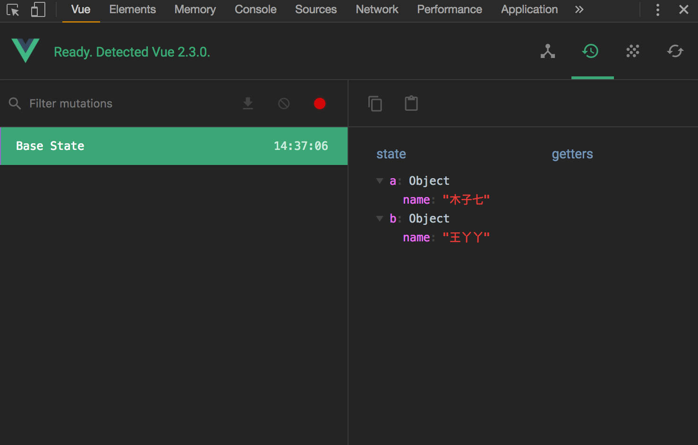

# Vuex modules 使用说明
## 索引
- [Modules - 基础使用](#modules)
- [Split - 拆分模块](#split)

## Modules
##### [返回索引](#索引)
**基础**
> 在未拆分的情况下，使用 modules 属性

在 `./main.js` 中定义modules
``` javascript
import Vue from 'vue'
import Vuex from 'vuex'
import App from './App'

Vue.use(Vuex)

// defined modules
const ModuleA = {
    state: {
        name: '木子七'
    }
}
const ModuleB = {
    state: {
        name: '王丫丫'
    }
}

// use modules
const store = new Vuex.Store({
    state: {
        rootState: 'i am rootState'
    },
    modules: {
        a: ModuleA,
        b: ModuleB
    }
})

// init
new Vue({
  el: '#app',
  router,
  store,
  template: '<App/>',
  components: { App }
})
```
<br/>

如果一切运行正常，在 `vue-devtools` 中可以看到：



🦊 可以看到，modules 中的 state 与根节点的 state 唯一的区别就是，modules 中的 state 被封装到一个对象里面，只要我们知道该对象的 key，就能访问到它。
``` javascript
import { mapState } from 'vuex'
export default {
    computed: {
        ...mapState([
            'rootState',
            'a',
            'b'
        ])
    }
}
```

<br/>

## `mutations actions getters`
这些属性并不会像 modules 中的 state 一样，被一个对象所包裹；\
事实上每一个模块中的这些属性，都是暴露出来的，所以他们的 **命名需要唯一**。\
如下实例：

`./main.js`
``` javascript
import Vue from 'vue'
import Vuex from 'vuex'
import App from './App'

Vue.use(Vuex)

const ModuleA = {
  state: {
    count: 0
  },
  getters: {
    // @param [state]     该参数是局部的，访问的是 module 中的状态
    // @param [rootState] 该参数访问的是根节点的 state 状态
    countFilterA (state, getters, rootState) {
      if (state.count > 5) {
        return state.count
      }
    }
  },
  mutations: {
    increaseA (state) {
      state.count ++
    }
  },
  actions: {
    increaseAsyncA ({ state, commit, rootState }) {
      if ((state.count + rootState.count) % 2 === 1) {
        commit('increaseA')
      }
    }
  }
}

const ModuleB = {
  state: {
    count: 0
  },
  getters: {
    countFilterB (state, getters, rootState) {
      if (state.count > 5) {
        return state.count + rootState.count
      }
    }
  },
  mutations: {
    increaseB (state) {
      state.count ++
    }
  }
}

// 根节点
const store = new Vuex.Store({
  state: {
    count: 10
  },
  modules: {
    a: ModuleA,
    b: ModuleB
  }
})

// init
new Vue({
  el: '#app',
  store,
  template: '<App/>',
  components: { App }
})
```

`./App.vue`
``` html
<template>
    <div class="contianer">
        {{countFilterA}}
        {{countFilterB}}
        <p>module-a: <button @click="increaseA">{{a.count}}</button></p>
        <p>module-b: <button @click="increaseB">{{b.count}}</button></p>
        <button @click="increaseAsyncA">actions</button>
    </div>
</template>

<script>
import { mapState } from 'vuex'
import { mapGetters } from 'vuex'
import { mapMutations } from 'vuex'
import { mapActions } from 'vuex'

export default {
    computed: {
        // state
        ...mapState([
            'a',
            'b'
        ]),
        // getters
        ...mapGetters([
            'countFilterA',
            'countFilterB'
        ])
    },
    methods: {
        // mutations
        ...mapMutations([
            'increaseA',
            'increaseB'
        ]),
        // actions
        ...mapActions([
            'increaseAsyncA'
        ])
    }
}
</script>
```

## split
> vuex 的模块拆分没有想象中的那么难，只要掌握 ES6 中 [Modules](http://www.infoq.com/cn/articles/es6-in-depth-modules) 相关的知识，就很容易理解。

### 1.项目结构
```
|-demo
  |--build
  |--config
  |--node_modules
  |--src
  |  |--assets
  |  |--components
  |  |--store
  |  |  |--actions 
  |  |  |  |--aAction.js
  |  |  |  |--bAction.js
  |  |  |  |--cAction.js
  |  |  |--constants
  |  |  |  |--types.js
  |  |  |--getters
  |  |  |  |--aGetter.js
  |  |  |--modules
  |  |  |  |--aModules.js
  |  |  |  |--bModules.js
  |  |  |  |--cModules.js
  |  |  |--mutations
  |  |  |  |--aMutation.js
  |  |  |  |--bMutation.js
  |  |  |  |--cMutation.js
  |  |  |--index.js
  |  |--App.vue
  |  |--main.js
  |--static
  |--utils
  |--test
  |--index.html
```
- `contstants/types.js`
    - 为了避免变量名冲突，这个 js 文件是用来存储一些 mutations 需要使用到的方法名称。
- `actions/aAction.js`
    - 所有的 actions 全部放在这个文件夹里。
    - 我们可以使用 actions 异步请求数据，再使用 mutations 将请求到的数据提交给 state。
- `mutations/aMutation.js`
    - 所有的 mutations 全部放在这个文件夹里。
    - mutations 负责提交修改对应的 modules 中 state 的值。
- `getters/aGetter.js`
    - 所有的 getters 圈全部放在这个文件夹里。
- `modules/aModules.js`
    - 这就是一个模块，所有的 `mutations actions getters` 都会作为变量导入到这里，组装成一个完整的模块。
- `index.js`
    - 出口文件，所有的模版汇集到这里，在根节点下组装，再导出到 main.js 中。
- `../main.js`
    - 在 main.js 中引入 store，完成整个模块制作。

### 2.type.js
> 这个文件负责定义 mutations 的方法名称。\
为避免命名冲突，需按照以下格式命名：
>> `event_moduleName_state`
``` javascript
// topics
export const FETCH_TOPICS_REQ = 'FETCH_TOPICS_REQ'
export const FETCH_TOPICS_SUC = 'FETCH_TOPICS_SUC'
export const FETCH_TOPICS_ERR = 'FETCH_TOPICS_ERR'

// comment
// ...
```

### 3.actions && mutations
> `actions` 与 `mutations` 一般配合使用\
`actions` 是负责处理异步方法的，所以用它来完成 ajax 请求；\
`mutations` 是负责处理同步方法的，并且改变 state 的值的唯一方式就是使用 `mutations` 提交；\
所以， 当 `actions` 完成请求获取数据后，再使用 `mutations` 提交给 state。

*actions/topics.js*
``` javascript
// 引入 type.js 中定义的方法名称
import { FETCH_TOPICS_REQ, FETCH_TOPICS_SUC, FETCH_TOPICS_ERR } from '../constants/types'
import axios from 'axios'

// 所有的 actions 都写在 topicsActions 对象中
// 格式：moduleNameActions
export const topicsActions = {
    // 请求 topics 的方法
    fetchTopicsActions({ commit, state }, param) {
        commit(FETCH_TOPICS_REQ);
        axios({
            method: 'get',
            url: 'topics'
        }).then((res) => {
            commit(FETCH_TOPICS_SUC, {
                data: res.data.data
            })
        }).catch((err) => {
            commit(FETCH_TOPICS_ERR, {
                error: err
            });
            console.log(err)
        });
    }
}
```

*mutations/topic.js*
``` javascript
// 引入 type.js 中定义的方法名称
import { FETCH_TOPICS_REQ, FETCH_TOPICS_SUC, FETCH_TOPICS_ERR } from '../constants/types'

// 所有的 mutations 都写在 topicsMutations 对象中
// 格式：moduleNameMutations
export const topicMutations = {
    FETCH_TOPICS_REQ(state) {
        state.isFetching = true
    },
    FETCH_TOPICS_SUC(state, action) {
        state.isFetching = false;
        state.data = action.data
    },
    FETCH_TOPICS_ERR(state, action) {
        state.isFetching = false;
        state.error = action.error
    }
}
```
### 4.getters
*getters/topic.js*
``` javascript
// 所有的 getters 都写在 topicsGetters 对象中
// 格式：moduleNameGetters
export const topicsGetters = {
    getDataLen (state) {
        return state.data.length
    }
}
```

### 5.modules
*modules/topic.js*
> 这里才是模块的主体，上面定义的 mutations actions getters 等文件都将作为变量引入到这里。\
在这里定义模块的 state 值；\
如果你不想将 getters 拆分出去，那可以单独在这里写 getter。
``` javascript
// 将定义好的 mutations actions getters 引入
import { topicMutations } from '../mutations/topics'
import { topicsActions } from '../actions/topics'
import { topicsGetters } from '../getters/topics'

// 组装一个模块
const topics = {
    state: {
        isFetching: false,
        data: []
    },
    getters: topicsGetters,
    mutations: topicMutations,
    actions: topicsActions
} 

// 导出该模块
export default topics
```

### 6.index.js
> index.js 是整个 modules 的出口文件；\
所有模块都会汇集到这里，在根节点下组装，并导出到 main.js 文件中去

*index.js*
``` javascript
import Vue from 'vue'
import Vuex from 'vuex'
Vue.use(Vuex)

// 引入 modules
import topics from './modules/topics'
// import xxx from 'xxx'
// ...

// 根节点 store
// 始终保持模块名称与导入名称一致
// [topics: topics]
const store = new Vuex.Store({
    state: {
        rootState: 'this is root state!'
    },
    modules: {
        topics
    }
})

export default store
```

### 7.main.js
> main.js 是整个项目的出口文件。\
在这个项目中引入 store，完成 vuex modules 的封装

*../main.js*
``` javascript
// ...
import store from './store'

new Vue({
    // ...
    store,
    // ...
})
```